<p align="center">
  <br>
  
  <br><br>
  <strong>纯 Go 开发 · 一切皆可热加载 · 无需重启 · 保证业务流畅性</strong>
  <br>
  <sub>Lightweight High-Performance Web Application Firewall — Pure Go, Hot-Reload Everything</sub>
  <br><br>
  <a href="#-快速开始"></a>
  
  
  
  
  
  
  
</p>

---

## 📖 概述

> **⚠️ 本项目目前处于开发测试阶段，服务端功能将逐步开放，敬请关注。**

FoxWAF 是一款**纯 Go 开发**的 Web 应用防火墙，以**单文件、零依赖**的设计理念，为中小型网站提供企业级安全防护。

**核心理念：一切皆可热加载，无需重启，保证业务零中断。** 站点配置、安全规则、ACL 策略、CC 防护、插件、证书 —— 所有变更即时生效，不丢失任何连接，不中断任何请求。

**主要解决的问题：**
- SQL 注入、XSS、路径遍历等 OWASP Top 10 威胁
- CC / DDoS 应用层攻击
- 恶意爬虫与自动化扫描工具
- 敏感信息泄露

---

## ✨ 特性一览

### 🔥 热加载能力

| 热加载项 | 说明 |
|:---|:---|
| 站点配置 | 添加 / 编辑 / 删除站点，即时生效 |
| 安全规则 | 内置规则 + 自定义规则，修改后毫秒级生效 |
| ACL 策略 | IP 黑白名单增删改，无需重启 |
| CC 防护 | 频率限制规则实时更新 |
| 插件系统 | 插件热加载 / 热卸载，扩展能力不中断服务 |
| SSL 证书 | 证书上传后自动加载，HTTPS 连接无感切换 |
| 系统设置 | 安全开关、匹配灵敏度等参数即改即生效 |

### 🛡️ 安全防护

- Aho-Corasick 多模式匹配引擎
- 丰富的内置安全规则（OWASP 覆盖）
- CC 攻击智能防护（JS Challenge / 滑块验证）
- 反爬虫 / 反自动化工具检测
- User-Agent 黑名单过滤
- 出站内容审计（敏感信息防泄露）
- 自定义规则引擎（多条件组合匹配）
- IP 黑白名单 / ACL 访问控制（全局 + 站点级）

### ⚡ 高性能架构

- 纯 Go 原生高并发处理
- 256 分片无锁计数器
- AC 自动机毫秒级规则匹配
- 静态资源智能缓存
- 请求体按需读取，零冗余 I/O
- Body 缓冲池复用（sync.Pool）
- HTTP/2 全链路支持（客户端 ↔ WAF ↔ 上游）
- 国密 GMTLS 双证书支持

### 🔧 运维友好

- 单文件部署，无外部依赖
- Docker 一键部署
- 可视化管理面板（实时监控 / 暗黑主题）
- 自动更新 + MD5 校验
- 一键备份恢复（含 Docker 镜像）
- SSL/TLS 证书在线管理
- 面板设置（密码修改 / 安全入口 / 端口）

### 🌐 代理能力

- HTTP / HTTPS 反向代理
- WebSocket 全双工代理
- 负载均衡（轮询 / 加权）
- 上游健康检查 + 故障摘除
- SNI 动态证书加载
- 自定义 Header / 路由规则

---

## 📸 功能截图

### 登录

安全入口 + 滑块验证登录，防止暴力破解。

<p align="center">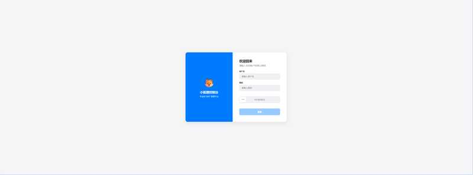</p>

### 数据概览

实时监控总请求数、拦截数、缓存命中率、规则总数、站点数，一目了然。

<p align="center">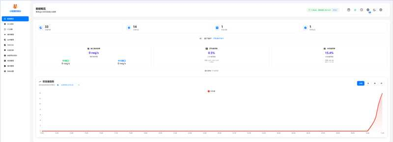</p>

支持暗黑主题，长时间运维不伤眼。

<p align="center">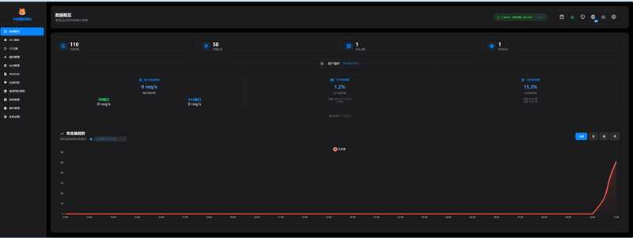</p>

### 站点管理

添加、编辑、删除站点，配置上游地址、HTTPS、负载均衡、HTTP/2 等，所有变更热加载生效。

<p align="center">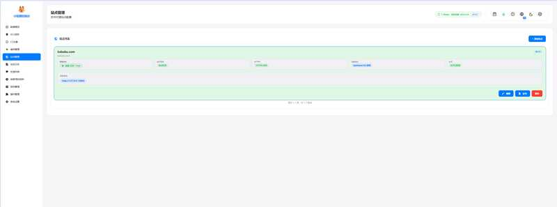</p>

站点编辑支持完整的反向代理参数配置：

<p align="center">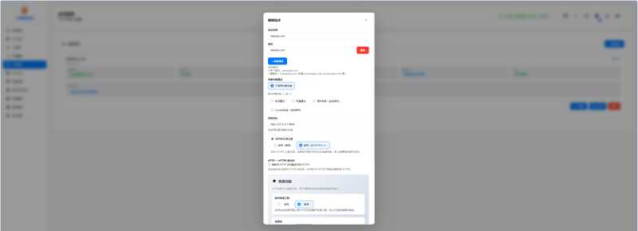</p>

在线管理 SSL/TLS 证书，上传后自动热加载，HTTPS 连接无感切换：

<p align="center"></p>

### 攻击日志

详细记录每一次攻击拦截，支持按攻击类型、IP、域名、规则等多维度筛选和搜索。

<p align="center">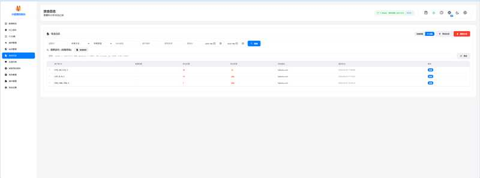</p>

<p align="center">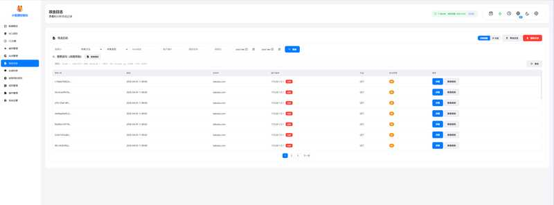</p>

点击任意日志可查看完整攻击详情，包括请求头、匹配规则、攻击载荷、GeoIP 等：

<p align="center">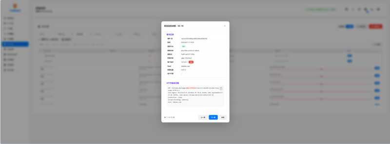</p>

### 拦截页面

命中 WAF 规则后，攻击者会看到拦截提示页面：

<p align="center"></p>

### ACL 访问控制

支持全局和站点级 IP 黑白名单，规则变更即时生效，无需重启。

<p align="center">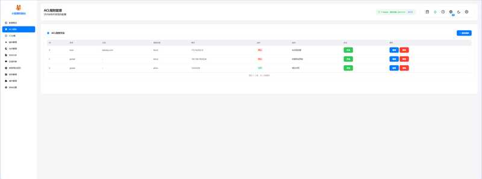</p>

<p align="center">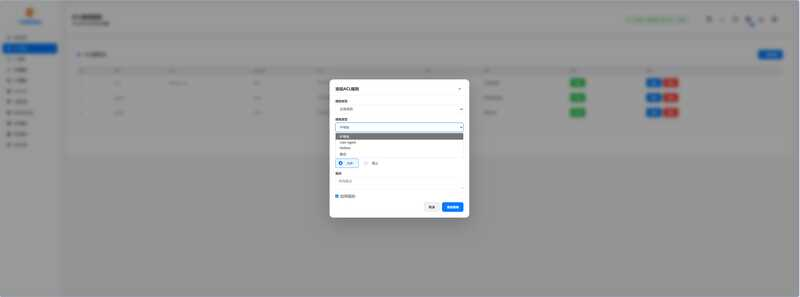</p>

<p align="center">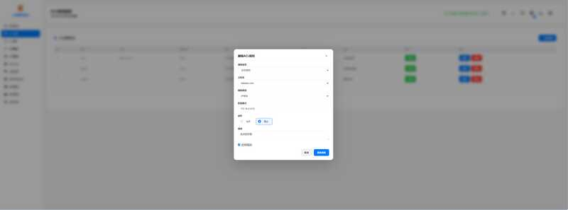</p>

### CC 防护

基于路径 + 域名的频率限制，支持 block（直接拦截）和 challenge（JS 挑战验证）两种动作。

<p align="center">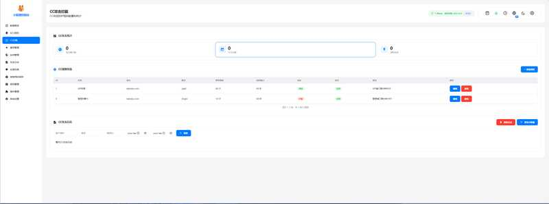</p>

<p align="center">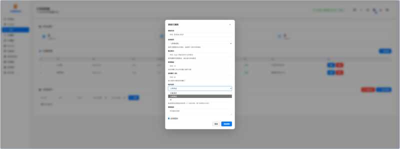</p>

<p align="center">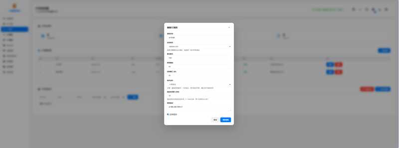</p>

触发 CC 防护时，用户需通过 JS Challenge 或滑块验证：

<p align="center">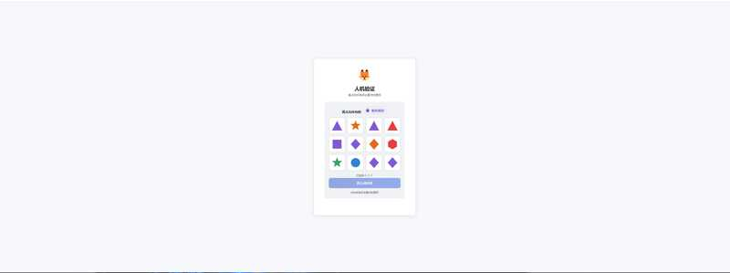</p>

<p align="center">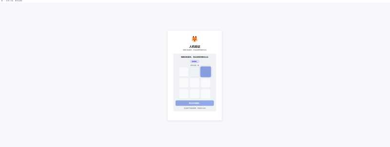</p>

<p align="center"></p>

### 自定义规则

可视化规则编辑器，支持多条件组合（URI / 参数 / Header / Body），contains / regex / equals 等匹配方式。规则热加载，保存即生效。

<p align="center">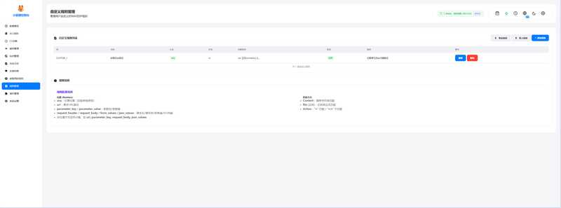</p>

<p align="center">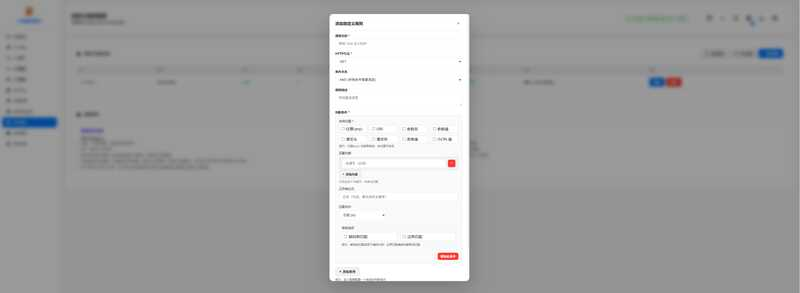</p>

### 缓存管理

内置静态资源缓存，按域名维度管理，支持一键清除。

<p align="center">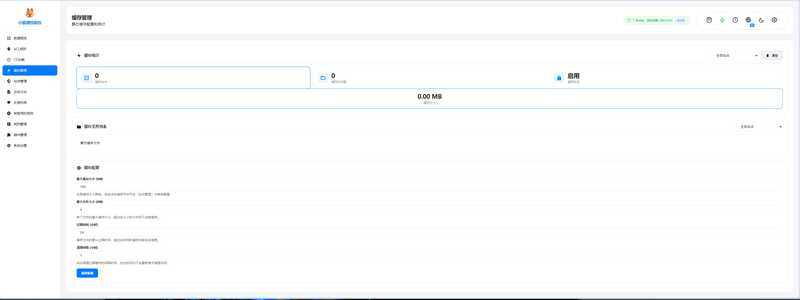</p>

### 已禁用规则

误报规则可一键禁用，不影响其他防护，随时可恢复启用。

<p align="center">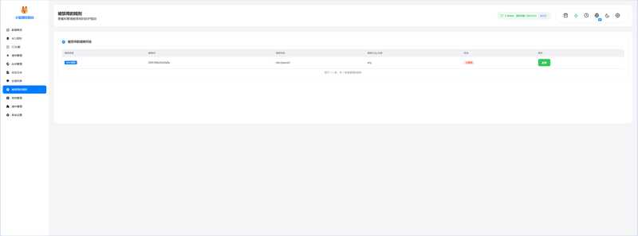</p>

### 插件管理

插件系统支持热加载 / 热卸载，扩展 User-Agent 校验、响应内容审计等能力，不中断任何请求。

<p align="center">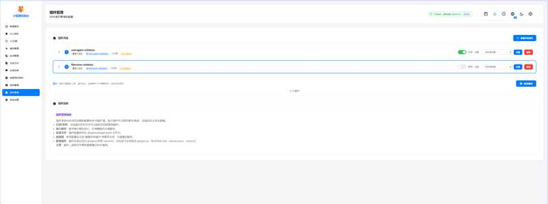</p>

> 🔌 **开发者文档**：如何构建插件、编写插件代码、打包格式与导入方式，完整指南见 [**插件开发指南 · doc/plugin-development.md**](./doc/plugin-development.md)。
>
> 📈 **性能文档**：单核 QPS / 协议对比 / 复现命令，见 [**单核 QPS 性能测试报告 · doc/perf-single-core-qps.md**](./doc/perf-single-core-qps.md)。

### 系统设置

全局安全开关：反爬虫、UA 检查、反 DevTools、规则匹配灵敏度、解码深度等，修改即时生效。

<p align="center">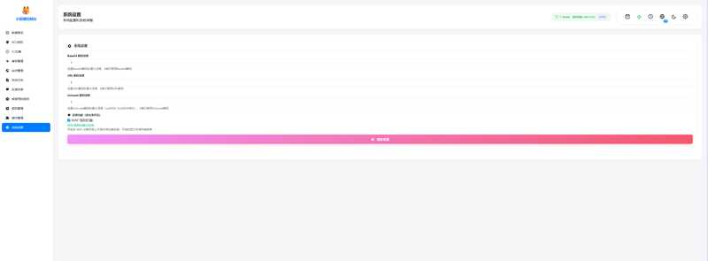</p>

### 面板设置

修改管理员密码、安全入口、面板端口，在线完成运维操作。

<p align="center">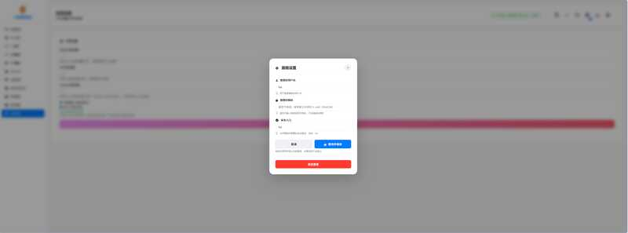</p>

### 反馈系统

内置反馈通道，用户可在拦截页面提交误报反馈，管理员在面板中审核处理。

<p align="center"></p>

<p align="center">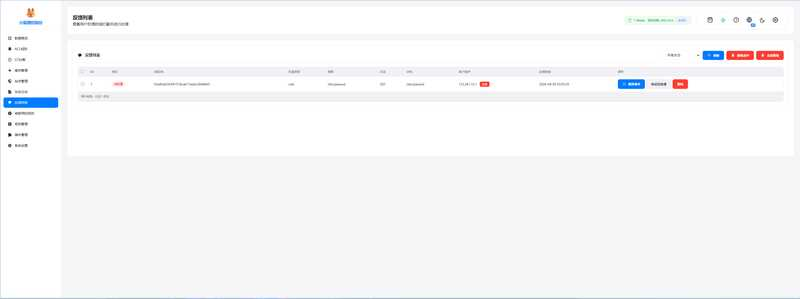</p>

### 跳转事件

记录并展示所有 301/302 跳转事件，便于排查配置问题。

<p align="center">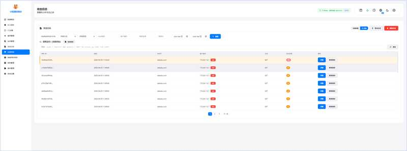</p>

### 命令行工具

`foxwaf` CLI 提供完整的服务管理能力：

<p align="center">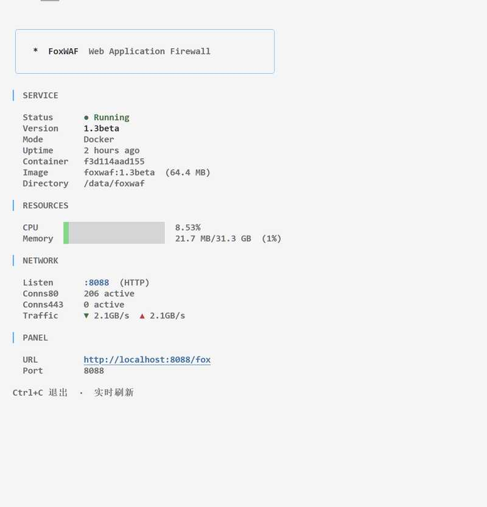</p>

---

## 🚀 性能测试

> 测试环境：WSL2 · Ubuntu 20.04 · 12th Gen Intel Core i5-12400F · 12 CPU

使用 [wrk](https://github.com/wg/wrk) 进行压测，WAF 全功能开启（全量规则 + AC 引擎 + CC 防护 + 插件链）：

```
$ wrk -t20 -c100 -d10s http://kabubu.com

Running 10s test @ http://kabubu.com
  20 threads and 100 connections
  Thread Stats   Avg      Stdev     Max   +/- Stdev
    Latency     2.08ms    3.30ms  88.87ms   89.24%
    Req/Sec     4.85k     1.56k   11.19k    69.90%
  968,932 requests in 10.10s, 9.23GB read
Requests/sec:  95,965.46
Transfer/sec:      0.91GB
```

| 指标 | 数值 |
|:---|:---|
| **QPS** | **~96,000 req/s** |
| 平均延迟 | 2.08 ms |
| 最大延迟 | 88.87 ms |
| 吞吐量 | 0.91 GB/s |
| 并发连接 | 100 |
| 测试线程 | 20 |
| 总请求数 | 968,932 (10s) |

> 在全规则检测开启的情况下，单机 QPS 仍可达到 **9.6 万+**，平均延迟仅 **2ms**，满足绝大多数中小型站点的防护需求。

---

## 🚀 快速开始

### 一键安装（推荐）

```bash
curl -fsSL https://raw.githubusercontent.com/foxwaf/foxwaf/main/install.sh | bash -s -- --version 1.39beta
```

安装脚本会自动检测环境、下载 Docker 镜像、配置并启动服务。

### 手动 Docker 部署

```bash
# 1. 从 Release 下载镜像包
curl -L -o foxwaf-image.tar.gz "<Release 下载地址>/foxwaf-image.tar.gz"

# 2. 导入镜像
docker load -i foxwaf-image.tar.gz

# 3. 创建配置目录并启动
mkdir -p /data/foxwaf && cd /data/foxwaf
docker compose up -d
```

### 安装选项

| 参数 | 说明 | 默认值 |
|:---|:---|:---|
| `--version VER` | 指定版本号 | 最新版 |
| `--dir PATH` | 安装目录 | `/data/foxwaf` |
| `--no-start` | 安装后不自动启动 | - |

---

## 🎛️ 管理命令

安装完成后，使用 `foxwaf` 命令管理服务：

```bash
foxwaf start          # 启动
foxwaf stop           # 停止
foxwaf restart        # 重启
foxwaf status         # 运行状态（CPU、内存、网络、版本）
foxwaf update         # 检查并应用更新
foxwaf export         # 备份（配置、数据库、证书、镜像）
foxwaf import <file>  # 从备份恢复
foxwaf uninstall      # 卸载（数据保留）
foxwaf version        # 当前版本号
```

---

## 💬 社区交流群

如果你在使用过程中遇到问题，或者想和其他用户交流规则/部署经验，可以加入我们的 QQ 交流群：

<p align="center">
  
</p>

---

## 💾 备份与恢复

```bash
# 导出完整备份
foxwaf export
# → /data/foxwaf/backup/foxwaf-20260328_120000.tar.gz

# 迁移到新服务器后恢复
foxwaf import /path/to/foxwaf-backup.tar.gz
```

备份包含：`conf.yaml`、数据库、运行时数据、SSL 证书、插件、Docker 镜像。

---

## 🔄 更新机制

```
检查更新 → 服务端返回版本 + 镜像源列表
              ↓
   按优先级尝试: GitHub → 服务端兜底
              ↓
      MD5 校验 → 导入新镜像 → 重启容器
              ↓（校验失败）
           自动回滚旧版本
```

支持两种更新方式：
- **命令行**：`foxwaf update`
- **管理面板**：面板内点击「检查更新」

---

## 🏗️ 架构

```
                      ┌─────────────────────────────────┐
                      │            FoxWAF                │
Client ─── HTTP/2 ───▶│                                  │──── Proxy ────▶ Upstream
Request    HTTPS      │  ┌──────────┐  ┌──────────────┐  │     HTTP/2      Servers
           GMTLS      │  │ AC 引擎  │  │   管理面板   │  │     HTTP/1.1
                      │  │ CC 防护  │  │   实时监控   │  │
                      │  │ 反爬虫   │  │   规则管理   │  │◀── Admin
                      │  │ ACL      │  │   证书管理   │  │
                      │  │ SSL/TLS  │  │   攻击日志   │  │
                      │  │ 插件链   │  │   插件系统   │  │
                      │  │ 负载均衡 │  │   缓存管理   │  │
                      │  └──────────┘  └──────────────┘  │
                      └─────────────────────────────────┘
```

**请求处理流程：**

```
请求进入 → IP 黑白名单 → CC 频率检测 → User-Agent 检查
    → 反爬虫验证 → WAF 规则匹配 (AC 自动机)
    → [插件链] → 缓存检查 → 反向代理
    → 响应内容审计 → 返回客户端
```

---

## ⚙️ 配置

默认配置文件 `conf.yaml` 位于安装目录：

```yaml
Database:
    DBName: waf.db
Server:
    Addr: 0.0.0.0
    Port: 8088
    HTTPS: false
Update:
    CheckIntervalMinutes: 0
    MaxBackupVersions: 0
    MaxBackupDays: 0
secureentry: fox
username: fox
password: fox
```

> ⚠️ **安装后请立即修改默认密码**（默认账号 `fox` / `fox`）

更多配置通过管理面板操作。

---

## 📋 系统要求

| 项目 | 最低要求 | 推荐配置 |
|:---|:---|:---|
| 操作系统 | Linux (x86_64) | Debian 11+ / Ubuntu 20.04+ |
| 内存 | 256 MB | 512 MB+ |
| 磁盘 | 200 MB | 1 GB+ |
| Docker | 20.10+ | 24.0+ |
| 网络端口 | 80, 443 | - |

---

## 📁 Release 文件说明

| 文件 | 说明 |
|:---|:---|
| `foxwaf-image.tar.gz` | Docker 镜像包（`docker load` 导入） |
| `foxwaf-image.tar.gz.md5` | 镜像 MD5 校验 |
| `waf` | WAF 主程序（Linux 二进制） |
| `waf.md5` | 主程序 MD5 校验 |
| `source.enc` | 加密资源文件（规则、静态资源） |
| `source.enc.md5` | 资源文件 MD5 校验 |
| `docker-compose.yaml` | Docker Compose 配置模板 |
| `install.sh` | 一键安装脚本 |
| `foxwaf` | 管理命令行工具 |

---

## 📄 许可证

本项目基于 [Apache License 2.0](LICENSE) 开源。

---

<p align="center">
  <sub>Copyright © 2026 FoxWAF · All rights reserved</sub>
</p>
